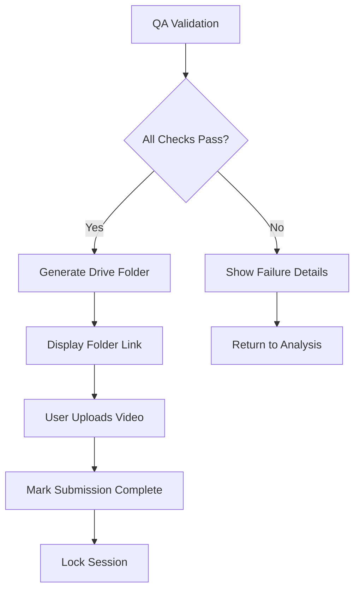

# 🎥 Gemini Live Video Verifier

A comprehensive multi-modal video analysis tool designed to validate Gemini Live interactions through automated content detection, language fluency analysis, and quality assurance validation. The application provides a three-screen Streamlit interface for processing video submissions with robust authentication and Google Drive integration.

## 🔍 Overview

The Gemini Live Video Verifier is a specialized tool for analyzing video recordings of AIT Inv agents working on Google's Gemini Live project. It automatically validates proper model usage, alias configuration, language fluency, and voice audibility to ensure quality submissions. The tool is particularly valuable for:

- **Gemini Live Interaction Validation**: Ensuring proper use of "2.5 Flash" model instead of "2.5 Pro"
- **Content Verification**: Automated detection of required text elements and alias names
- **Language Assessment**: Multi-language speech analysis with fluency scoring
- **Voice Quality Control**: Dual-voice detection ensuring both user and model voices are audible
- **Quality Assurance**: Comprehensive pass/fail validation before submission

## ✨ Key Features

### 🖥️ Three-Screen Progressive Interface

The application follows a structured workflow through three distinct screens:

| Screen                  | Purpose                | Key Functions                                                                        |
| ----------------------- | ---------------------- | ------------------------------------------------------------------------------------ |
| **1. Input Parameters** | Configuration & Upload | Question ID validation, email authorization, video upload with property validation   |
| **2. Video Analysis**   | Processing & Results   | Real-time analysis with progress tracking, detailed detection results, QA validation |
| **3. Video Submission** | Final Submission       | Google Drive folder creation, submission tracking, session management                |

### 🔍 Multi-Modal Analysis Engine

#### Text Detection (OCR-Based)

- **"2.5 Flash" Model Verification**: Prevents incorrect "2.5 Pro" usage with visual validation
- **Alias Name Recognition**: Detects "Roaring tiger" text with fuzzy matching capabilities
- **Eval Mode Detection**: Identifies "Eval Mode: Native Audio Output" text
- **Advanced OCR Pipeline**: Includes denoising, thresholding, and error correction
- **Bounding Box Visualization**: Screenshot generation with annotations

#### Audio Analysis (Whisper-Based)

- **Language Fluency Analysis**: Multi-language transcription and fluency scoring
- **Voice Activity Detection (VAD)**: Advanced audio processing for voice identification
- **Speaker Diarization**: Distinguishes between user and model voices
- **Multi-Language Support**: 25+ languages

#### Quality Assurance System

- **Pass/Fail Validation**: Comprehensive scoring across all detection types
- **Real-time Feedback**: Immediate validation results with detailed explanations
- **Performance Metrics**: Analysis timing and efficiency tracking

### 🛡️ Security & Authorization

#### Google Sheets Integration

- **Dynamic Authorization**: Real-time validation against authorized Question IDs and email addresses
- **Secure API Communication**: Encrypted communication with Google Apps Script
- **Session-Based Access Control**: Unique session management with cleanup

#### Data Privacy & Session Management

- **Temporary File Handling**: Automatic cleanup of uploaded videos and analysis artifacts
- **Session Isolation**: Each analysis session operates independently
- **Resource Management**: Intelligent memory and storage cleanup

### 📊 Advanced Reporting

#### Export Capabilities

- **JSON Results Export**: Comprehensive analysis results in structured format
- **Screenshot Management**: Automated screenshot generation for positive detections
- **QA Report Generation**: Detailed quality assurance reports with pass/fail criteria

## 🚀 Installation & Setup

### System Requirements

| Component        | Requirement                                        |
| ---------------- | -------------------------------------------------- |
| **Python**       | 3.8+ (recommended 3.11)                            |
| **Memory**       | Minimum 4GB RAM (8GB recommended for large videos) |
| **Storage**      | 2GB free space for temporary files                 |
| **Dependencies** | Tesseract OCR, FFmpeg                              |

### 1. Repository Setup

```bash
# Clone the repository
git clone https://github.com/Juan-Vergara-INV/Gemini-Live-Video-Verifier.git
cd Gemini-Live-Video-Verifier

# Create virtual environment (recommended)
python -m venv gemini-verifier
source gemini-verifier/bin/activate  # On Windows: gemini-verifier\Scripts\activate
```

### 2. Install Dependencies

```bash
# Install Python packages
pip install -r requirements.txt

# Install system dependencies
# Ubuntu/Debian:
sudo apt-get update
sudo apt-get install tesseract-ocr tesseract-ocr-eng ffmpeg

# macOS:
brew install tesseract ffmpeg

# Windows: Download and install from official websites
```

### 3. System Configuration

#### Required External Tools

```bash
# Verify Tesseract installation
tesseract --version

# Verify FFmpeg installation
ffmpeg -version
```

## ⚙️ Configuration & Setup

#### 1. Streamlit Secrets Configuration

Create `.streamlit/secrets.toml`:

```toml
[google]
apps_script_url = "https://script.google.com/macros/s/YOUR_SCRIPT_ID/exec"
verifier_sheet_url = "https://docs.google.com/spreadsheets/d/YOUR_SHEET_ID/edit"
verifier_sheet_id = "YOUR_SHEET_ID"
verifier_sheet_name = "Authorized Users"
```

### 2. Language Configuration

The system supports 25 languages with automatic inference from Question IDs:

| Language Code | Display Name            |
| ------------- | ----------------------- |
| `ar-EG`       | Arabic (Egypt)          |
| `bn-IN`       | Bengali (India)         |
| `de-DE`       | German (Germany)        |
| `en-IN`       | English (India)         |
| `es-419`      | Spanish (Latin America) |
| `fr-FR`       | French (France)         |
| `hi-IN`       | Hindi (India)           |
| `id-ID`       | Indonesian (Indonesia)  |
| `it-IT`       | Italian (Italy)         |
| `ja-JP`       | Japanese (Japan)        |
| `ko-JA`       | Korean (Japan variant)  |
| `ko-KR`       | Korean (South Korea)    |
| `ko-ZH`       | Korean (China variant)  |
| `ml-IN`       | Malayalam (India)       |
| `nl-NL`       | Dutch (Netherlands)     |
| `pl-PL`       | Polish (Poland)         |
| `pt-BR`       | Portuguese (Brazil)     |
| `ru-RU`       | Russian (Russia)        |
| `sv-SE`       | Swedish (Sweden)        |
| `te-IN`       | Telugu (India)          |
| `th-TH`       | Thai (Thailand)         |
| `tr-TR`       | Turkish (Turkey)        |
| `vi-VN`       | Vietnamese (Vietnam)    |
| `zh-CN`       | Chinese (Simplified)    |
| `zh-TW`       | Chinese (Traditional)   |

## 📖 Usage Guide

### 1. Application Startup

```bash
# Start the Streamlit application
streamlit run video_analyzer.py
```

### 2. Screen 1: Input Parameters

#### Required Information

| Field           | Description                            | Validation                               |
| --------------- | -------------------------------------- | ---------------------------------------- |
| **Question ID** | Unique identifier for analysis session | Must exist in authorized Google Sheet    |
| **Alias Email** | Email address for authorization        | Must exist in authorized Google Sheet    |
| **Video File**  | MP4 video for analysis                 | Max 1GB, min 30s, portrait mobile format |

#### Automatic Validations

- **Authorization Check**: Real-time validation against Google Sheets
- **Language Inference**: Automatic target language detection from Question ID pattern
- **Video Properties**: Duration, resolution, and audio quality validation
- **File Format**: MP4 format verification and size limits

#### Video Requirements

| Property        | Requirement                | Validation Method                    |
| --------------- | -------------------------- | ------------------------------------ |
| **Format**      | MP4 only                   | File extension and header validation |
| **Size**        | Maximum 1GB                | File size check during upload        |
| **Duration**    | Minimum 30 seconds         | Video metadata extraction            |
| **Orientation** | Portrait mobile format     | Aspect ratio validation (1.6-2.5)    |
| **Resolution**  | Mobile-friendly dimensions | Width 360-1600px, height > width     |
| **Audio**       | Must contain audio track   | Audio stream detection               |

### 3. Screen 2: Video Analysis

#### Analysis Pipeline

The analysis follows a structured pipeline with real-time progress tracking:

##### Phase 1: Audio Extraction & Setup

- Extract audio track from video
- Load Whisper model for transcription
- Initialize analysis components

##### Phase 2: Audio Analysis

- **Voice Audibility Detection**: Identify number of distinct speakers
- **Language Fluency Analysis**: Transcribe and analyze spoken language

##### Phase 3: Video Frame Processing

- **Flash/Alias Detection**: Frame-by-frame analysis of first 5 seconds
- **Eval Mode Detection**: Adaptive search strategy (1s then 10s intervals)
- **OCR Processing**: Text extraction with error correction

##### Phase 4: Quality Assurance

- Validate all detection results
- Generate QA report
- Prepare submission data

#### Analysis Results Display

Results are organized by detection type with expandable sections:

- **📝 Text Detection Results**

  - 2.5 Flash Detection (with model validation)
  - Alias Name Detection ("Roaring tiger")
  - Eval Mode Detection
  - Screenshots for positive detections

- **🗣️ Language Fluency Analysis**

  - Target vs detected language comparison
  - Full transcription display
  - Fluency scoring and validation

- **👥 Voice Audibility Analysis**
  - Number of detected voices
  - Voice activity ratio
  - Speaker separation analysis

### 4. Screen 3: Video Submission

#### Google Drive Integration

Once quality assurance checks pass, the system provides automated video submission:

1. **Folder Generation**: Creates timestamped Google Drive folder
2. **Access Management**: Sets appropriate sharing permissions
3. **Submission Tracking**: Monitors completion status
4. **Session Locking**: Prevents duplicate submissions

#### Submission Workflow



## 🎯 Detection Types & Analysis Methods

### 1. Text Detection (OCR-Based)

#### "2.5 Flash" Model Verification

**Purpose**: Ensure correct Gemini model usage and prevent "2.5 Pro" mistakes

**Detection Strategy**:

- Frame-by-frame analysis of first 5 seconds
- Advanced OCR with preprocessing (denoising, thresholding)
- Fuzzy text matching with error correction
- Model validation (Flash vs Pro differentiation)

**Pass Criteria**:

- ✅ "2.5 Flash" text detected in video
- ❌ "2.5 Pro" detected instead (automatic failure)
- ❌ Neither model text found

#### Alias Name Recognition

**Purpose**: Validate correct alias configuration

**Detection Method**:

- Simultaneous detection with Flash text
- Pattern matching for "Roaring tiger" with variants
- Handles spacing and punctuation variations
- OCR error correction for common misreadings

**Pass Criteria**:

- ✅ "Roaring tiger" text detected
- ❌ Alias name not found

#### Eval Mode Detection

**Purpose**: Confirm proper evaluation mode settings

**Detection Strategy**:

- Adaptive search starting after Flash detection
- Two-phase approach: 1s intervals, then 10s intervals
- Comprehensive phrase matching for "Eval Mode: Native Audio Output"
- Early termination on successful detection

**Pass Criteria**:

- ✅ "Eval Mode: Native Audio Output" detected
- ❌ Eval mode text not found

### 2. Audio Language Analysis

#### Whisper-Based Transcription

**Technology**: OpenAI Whisper (base model)
**Capability**: 99+ languages with automatic detection

**Analysis Process**:

1. Audio extraction from video
2. Full transcription with language detection
3. Target language comparison
4. Fluency scoring based on transcription quality

**Fluency Validation**:

- **Language Match**: Detected language matches expected
- **Word Count**: Minimum threshold for meaningful content
- **Transcription Quality**: Text coherence and completeness

**Pass Criteria**:

- ✅ Detected language matches target language from Question ID
- ✅ Sufficient transcribable content
- ❌ Language mismatch or insufficient content

### 3. Voice Audibility Detection

#### Advanced Speaker Analysis

**Multi-Feature Approach**:

- **Voice Activity Detection (VAD)**: Energy, zero-crossing rate, spectral analysis
- **MFCC Analysis**: Mel-frequency cepstral coefficients for speaker characteristics
- **Temporal Dynamics**: Speaker transition detection
- **Pitch Analysis**: Fundamental frequency variation analysis

#### Speaker Count Estimation

**Algorithm**: Combines multiple audio features for robust detection

- **MFCC Variance**: Temporal changes indicating speaker switches
- **Pitch Distribution**: Bimodal analysis for multiple speakers
- **Spectral Features**: Voice characteristic differentiation
- **Voice Activity Ratio**: Conversation vs monologue patterns

**Pass Criteria**:

- ✅ Exactly 2 distinct voices detected (user + model)
- ❌ 0 voices (no audio) or 1 voice (missing participant)
- ❌ 3+ voices (background noise or additional speakers)

## 📊 Quality Assurance Framework

### Comprehensive Validation System

The QA system evaluates five critical areas with specific pass/fail criteria:

| QA Check             | Weight | Pass Criteria                             | Failure Impact |
| -------------------- | ------ | ----------------------------------------- | -------------- |
| **Flash Presence**   | 20%    | "2.5 Flash" detected, not "2.5 Pro"       | Cannot submit  |
| **Alias Name**       | 20%    | "Roaring tiger" detected                  | Cannot submit  |
| **Eval Mode**        | 20%    | "Eval Mode: Native Audio Output" detected | Cannot submit  |
| **Language Fluency** | 20%    | Target language match with transcription  | Cannot submit  |
| **Voice Audibility** | 20%    | Exactly 2 audible voices detected         | Cannot submit  |

### QA Result Interpretation

#### PASS Status (All checks successful)

```
✅ Quality Assurance: PASSED - All requirements met!
├── ✅ 2.5 Flash Text Detection - PASS
├── ✅ Alias Name Text Detection - PASS
├── ✅ Eval Mode Text Detection - PASS
├── ✅ Language Fluency Analysis - PASS
└── ✅ Voice Audibility Analysis - PASS

🎯 Your video meets all quality requirements and is ready for submission!
```

#### FAIL Status (One or more checks failed)

```
❌ Quality Assurance: FAILED - 2/5 checks passed
├── ❌ 2.5 Flash Text Detection - FAIL: Incorrect Model Detected
├── ✅ Alias Name Text Detection - PASS
├── ❌ Eval Mode Text Detection - FAIL: Not Found
├── ✅ Language Fluency Analysis - PASS
└── ❌ Voice Audibility Analysis - FAIL: Only 1 Voice Detected

⚠️ Your video cannot be submitted. Please review the failed checks and re-record.
```

### Detailed Feedback System

Each failed check provides specific guidance:

- **Flash Detection Failure**: "Please ensure you're using Gemini 2.5 Flash, not Pro"
- **Alias Issues**: "Verify 'Roaring tiger' is visible in the interface"
- **Eval Mode Missing**: "Enable 'Eval Mode: Native Audio Output' before recording"
- **Language Problems**: "Speak clearly in [Expected Language]"
- **Voice Issues**: "Ensure both your voice and the model's voice are audible"

## 🔒 Security & Authentication

### Multi-Layer Authorization

#### Google Sheets Integration

- **Dynamic Validation**: Real-time authorization against centralized sheets
- **Dual Authentication**: Both Question ID and Email must be authorized
- **Session Security**: Unique session tokens with automatic cleanup

#### Data Protection

- **Temporary Storage**: All uploaded videos automatically deleted after analysis
- **Session Isolation**: Each user session operates independently
- **Resource Cleanup**: Automatic memory and disk cleanup after completion

### Privacy & Compliance

- **No Permanent Storage**: Videos and audio are never permanently stored
- **Session-Based Processing**: All data tied to temporary sessions
- **Automatic Cleanup**: Resources cleaned up within 24 hours maximum
- **Audit Trail**: Session IDs for tracking without storing personal data

## 🛠️ System Architecture & Performance

### Technical Stack

| Component              | Technology         | Purpose                         |
| ---------------------- | ------------------ | ------------------------------- |
| **Frontend**           | Streamlit          | Multi-screen web interface      |
| **Computer Vision**    | OpenCV + Tesseract | OCR and image processing        |
| **Audio Processing**   | Librosa + Whisper  | Voice and language analysis     |
| **Cloud Integration**  | Google APIs        | Authorization and storage       |
| **Session Management** | Custom threading   | Resource and cleanup management |

## 🚨 Troubleshooting Guide

### Common Installation Issues

#### Tesseract OCR Problems

```bash
# Error: "TesseractNotFoundError"
# Solution Ubuntu/Debian:
sudo apt-get install tesseract-ocr tesseract-ocr-eng

# Solution macOS:
brew install tesseract

# Solution Windows:
# Download from: https://github.com/UB-Mannheim/tesseract/wiki
# Add to PATH: C:\Program Files\Tesseract-OCR
```

#### FFmpeg Installation

```bash
# Error: "ffmpeg not found"
# Solution Ubuntu/Debian:
sudo apt-get install ffmpeg

# Solution macOS:
brew install ffmpeg

# Solution Windows:
# Download from: https://ffmpeg.org/download.html
# Add to system PATH
```

#### Python Dependencies

```bash
# Error: Package installation failures
# Solution: Use virtual environment
python -m venv venv
source venv/bin/activate  # Windows: venv\Scripts\activate
pip install --upgrade pip
pip install -r requirements.txt
```

### Runtime Issues & Solutions

#### Analysis Failures

**OCR Detection Issues**:

- **Symptoms**: Text not detected despite being visible
- **Solutions**:
  - Ensure good video quality and lighting
  - Check if text is clearly visible and not blurred

**Audio Analysis Problems**:

- **Symptoms**: "No voices detected" or incorrect language
- **Solutions**:
  - Check audio levels and clarity
  - Ensure both participants speak clearly
  - Minimize background noise
  - Verify microphone is working properly

**Authorization Failures**:

- **Symptoms**: "Not authorized" errors
- **Solutions**:
  - Verify Question ID exists in Google Sheet
  - Confirm email address is properly authorized
  - Contact administrator to verify credentials

## Roadmap & Development Status

### ✅ Implemented Features (v1.0)

### 1. Core Video Analysis Features

- [x] **Multi-Modal Content Detection:** Text (OCR), Audio (Whisper), and Video processing with real-time progress tracking
- [x] **Advanced OCR Pipeline:** Denoising, thresholding, and error correction for text detection
- [x] **Speaker Diarization:** Voice activity detection and speaker count estimation
- [x] **Language Fluency Analysis:** 25+ language support with automatic inference from Question IDs
- [x] **Model Verification:** "2.5 Flash" vs "2.5 Pro" detection and validation with screenshot capture
- [x] **Alias Name Recognition:** "Roaring tiger" text detection with fuzzy matching capabilities
- [x] **Eval Mode Detection:** "Eval Mode: Native Audio Output" identification with adaptive search
- [x] **Voice Audibility Validation:** Dual-voice detection ensuring both user and model voices are audible

### 2. Quality Assurance & User Interface

- [x] **Comprehensive Pass/Fail Validation:** 5-point QA system with detailed feedback and guidance
- [x] **Three-Screen Progressive Workflow:** Input Parameters → Video Analysis → Video Submission
- [x] **Google Sheets Authorization:** Dynamic validation against centralized user database
- [x] **Session Management:** Temporary file handling with automatic cleanup and resource optimization
- [x] **Google Sheets Export Capabilities:** Google Sheets results export for metrics tracking
- [x] **Google Drive Integration:** Automated folder creation for video submissions with access management

### 3. Advanced Audio Quality Control

- [ ] **Background Noise Detection:** Ambient noise level analysis with music, TV, and household noise identification
- [ ] **Echo & Reverb Analysis:** Room acoustics assessment with echo detection and intensity measurement
- [ ] **Missing Voice Identification:** In cases where only one voice is audible, identify the missing voice, which can be either LLM or user.

### 4. Enhanced Content Verification

- [ ] **Multi-App Screen Detection:** Identification of non-Gemini applications visible on screen
- [ ] **Notifications Detection:** Detections of notifications on the screen or any other personal information
- [ ] **Real-time Content Monitoring:** Live detection of inappropriate content during recording

### 5. Enhanced Task Types and Task Completion Functionalities
- [ ] **Task Types Logic:** Implementation of functionality for various task types, including language learning, code-mixed tasks, and monolingual tasks.
- [ ] **Upload Video to Google Folder:** Functionality to directly upload analyzed videos to Google Drive upon task submission and folder creation, allowing users to save time by not having to upload videos manually.

## 📞 Support & Contact

### Self-Help Resources

1. **Application Help**: Use the built-in help section (❓ icon in sidebar)
2. **Session Information**: Check current session details in sidebar
3. **QA Feedback**: Read specific failure messages for guidance

### Getting Technical Support

**Before Contacting Support**, please gather:

- Session ID (visible in sidebar)
- Error messages (exact text)
- Video file properties (size, duration, resolution)
- Browser and operating system information
- Screenshot of the issue

**Support Contact**:

- **Juan Vergara** on Slack for technical support

### Feature Requests & Feedback

For suggestions, improvements, or feature requests:

1. Document the current behavior
2. Describe the desired functionality
3. Explain the use case or benefit
4. Contact Juan Vergara via Slack with detailed requirements
